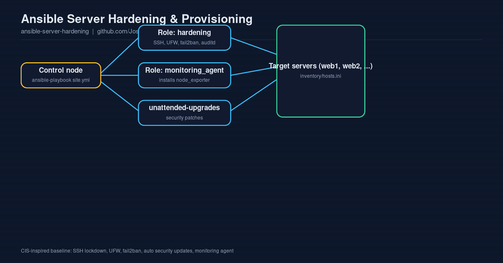

# Ansible Server Hardening & Provisioning

[](https://github.com/JoseFilhoMax/ansible-server-hardening/actions/workflows/lint.yml)
[](LICENSE)

CIS-inspired baseline hardening for fresh Ubuntu servers, plus a monitoring agent role — the two playbooks I'd actually run before putting a new box into production.



## What it does

**`roles/hardening`**
- Creates non-root sudo users, disables SSH root login and password auth (key-only)
- Configures UFW with a default-deny policy and only the ports you allow
- Installs and configures `fail2ban` for SSH brute-force protection
- Enables `unattended-upgrades` for automatic security patches
- Enables `auditd` for system call auditing

**`roles/monitoring_agent`**
- Installs Prometheus `node_exporter` as a systemd service, ready to be scraped by a stack like [`docker-monitoring-stack`](https://github.com/JoseFilhoMax/docker-monitoring-stack)

## Usage

```bash
git clone https://github.com/JoseFilhoMax/ansible-server-hardening.git
cd ansible-server-hardening
ansible-galaxy install -r requirements.yml   # community.general (ufw module)
cp inventory/hosts.ini inventory/production.ini
# edit inventory/production.ini with your real hosts

ansible-playbook site.yml -i inventory/production.ini --syntax-check
ansible-playbook site.yml -i inventory/production.ini --check   # dry run
ansible-playbook site.yml -i inventory/production.ini           # apply
```

## Customizing

All tunables live in `roles/*/defaults/main.yml` — SSH port, allowed users, fail2ban thresholds, allowed firewall ports, node_exporter version. Override them per-environment with `-e` or group_vars.

## CI

Every PR runs a playbook syntax check and `ansible-lint`.

## License

MIT — see [LICENSE](LICENSE). Contributions welcome, see [CONTRIBUTING.md](CONTRIBUTING.md).
